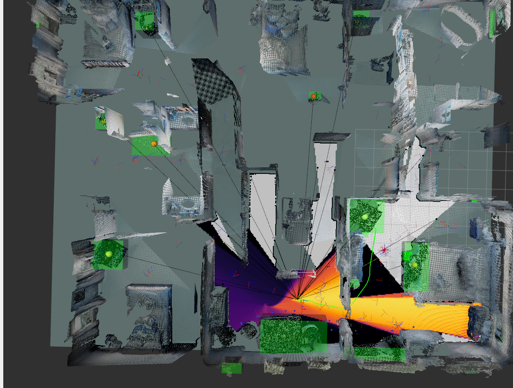
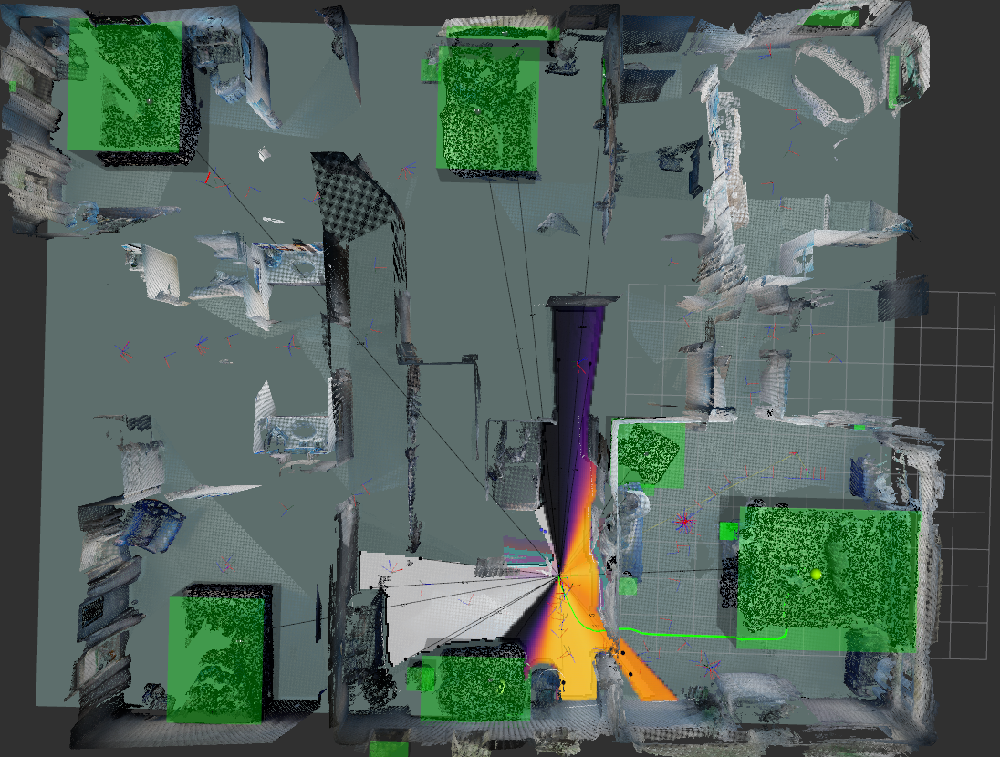

# **SAGE (Semantic-Aware Guided Exploration with persistent Memory)**

https://github.com/matterport/habitat-matterport-3dresearch





## Setup
```bash
git submodule update --init --recursive --remote

rosdep update
rosdep install --rosdistro humble --from-paths src --ignore-src -r -y
```

### Install weights

1. SAGE/exploitation_ws/src/openfusion_ros/openfusion_ros/openfusion_ros/zoo/xdecoder_seem/checkpoints/seem_focall_v1.pt:
https://huggingface.co/xdecoder/SEEM/resolve/main/seem_focall_v1.pt

2. SAGE/detection_ws/src/seem_ros/seem_ros/seem_ros/seem_focall_v0.pt:
https://huggingface.co/xdecoder/SEEM/resolve/main/seem_focall_v0.pt