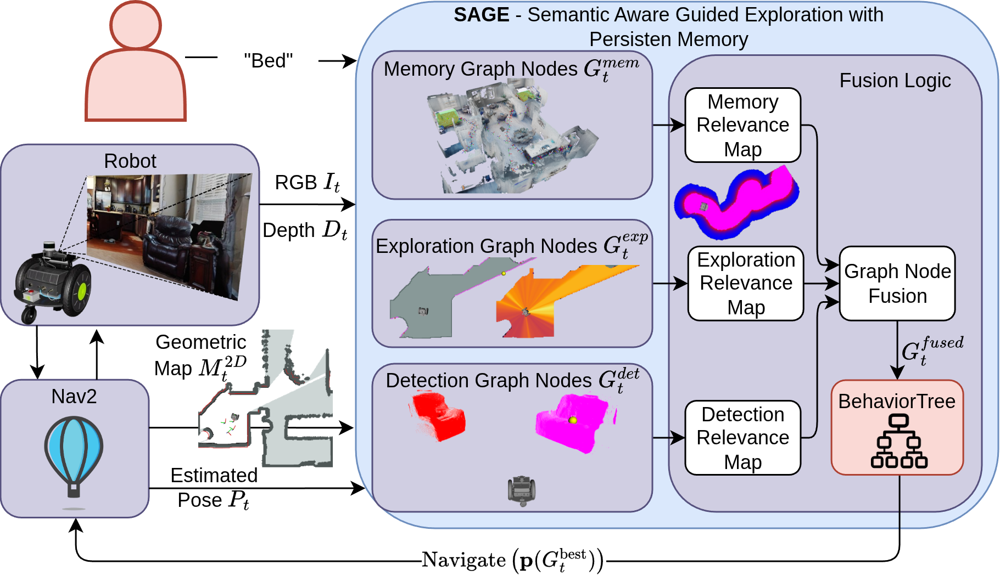

# SAGE: Semantic-Aware Guided Exploration with Persistent Memory

SAGE is a ROS 2-based autonomous exploration framework that combines frontier exploration, semantic 3D mapping, zero-shot object detection, and vision-language reasoning to search for user-specified objects in simulated indoor environments.

## Badges

### Frameworks


### Technologies


### Programming Languages


### Development Tools


---

## Overview

SAGE, short for **Semantic-Aware Guided Exploration with Persistent Memory**, is a modular robotics framework for semantic object search in simulated indoor environments.

The system extends classical frontier-based exploration with semantic perception and persistent spatial memory. Instead of relying only on geometric information such as occupancy grids and frontiers, SAGE integrates semantic 3D mapping, zero-shot object detection, segmentation, and vision-language reasoning. This enables a robot to explore an unknown environment while searching for objects or concepts specified through natural-language prompts.

SAGE is built on **ROS 2 Humble** and uses **Nav2** for navigation and exploration, **OpenFusion** and **SEEM** for semantic 3D mapping, **YOLO-E** for zero-shot object detection, and **BLIP2/LAVIS** for vision-language similarity scoring. The framework is evaluated in simulation using **NVIDIA Isaac Sim**.

---

## Thesis Context

This repository contains the implementation developed as part of the following master thesis:

📄 [Master Thesis PDF](./docs/thesis.pdf)

| Field | Information |
|---|---|
| Thesis title | SAGE: Multi-Object Semantic-Aware Guided Exploration with Persistent Memory |
| Author | Kevin Eppacher, BSc |
| Degree | Master of Science in Engineering |
| Degree program | Mechatronics/Robotics |
| University | University of Applied Sciences Technikum Wien |
| Supervisors | Simon Schwaiger, MSc; FH-Prof. Dr.techn. Mohamed Aburaia, MSc. |
| Location | Vienna |
| Submission date | January 31, 2026 |
| Thesis DOI / permanent link | https://resolver.obvsg.at/urn:nbn:at:at-ftw:1-80432 |

---

## Motivation

Autonomous robots commonly explore unknown environments using geometric information, for example occupancy maps, costmaps, and frontier-based exploration strategies. While these methods are effective for covering space, many practical tasks require semantic understanding.

A robot searching for an object such as a `flowerpot`, `chair`, or `bed` benefits from knowing not only where it has been, but also what it has seen, where objects are likely to be located, and how previous observations relate to the current task.

SAGE addresses this problem by integrating semantic perception and persistent memory into a ROS 2 exploration pipeline. The framework enables a robot to search for object-level goals, store semantic observations, and use vision-language components to support more informed exploration behavior.

---

## Main Contributions

The main contributions of SAGE are:

- A hybrid framework for open-vocabulary, multi-object semantic exploration.
- Semantic frontier exploration guided by vision-language similarity.
- Persistent 3D semantic memory based on OpenFusion for long-horizon exploitation.
- Promptable zero-shot object detection using YOLO-E.
- Multi-source semantic fusion combining detector confidence, vision-language similarity, and memory evidence.
- A Noisy-Or-based fusion strategy for reducing missed detections under conservative thresholds.
- A behavior-tree-based control architecture for semantic-guided exploration and verification.
- Evaluation in NVIDIA Isaac Sim using Habitat-Matterport3D Version 2 scenes.
- Analysis of success rate, SPL, exploration-memory weighting, semantic map granularity, precision-recall behavior, GPU memory use, and runtime characteristics.

---

## System Architecture



SAGE is organized into multiple Docker containers and ROS 2 workspaces. Each container is responsible for a specific part of the exploration, perception, or simulation pipeline.

| Module | Description |
|---|---|
| Explorer container | Runs navigation, mapping, frontier exploration, behavior tree execution, and high-level task control. |
| Detection container | Runs YOLO-E-based zero-shot object detection and point cloud processing. |
| Exploitation container | Runs OpenFusion with SEEM for semantic mapping and point cloud processing. |
| LAVIS container | Runs BLIP2-based vision-language cosine similarity scoring as a ROS 2 service. |
| Isaac Sim container | Provides the simulation environment and robot interface. |

---

## Repository Structure

```bash
SAGE/
├── docker/                  # Docker Compose setup and container helper scripts
├── explorer_ws/             # ROS 2 workspace for exploration, navigation, and task control
├── detection_ws/            # ROS 2 workspace for YOLO-E-based object detection
├── exploitation_ws/         # ROS 2 workspace for OpenFusion, SEEM, and semantic mapping
├── lavis_ws/                # ROS 2 workspace for BLIP2/LAVIS integration
├── isaac_sim/               # Isaac Sim environment, assets and robot USD files
├── sage_commander/          # ROS 2 package for launching and coordinating the different SAGE components
├── sage_evaluator/          # ROS 2 package for saving experiment results and evaluation scripts
├── docs/                    # Documentation, figures, installation notes, and thesis material
├── experiments/             # Experiment configurations, evaluation scripts, and results
├── LICENSE                  # Project license
└── README.md                # Project documentation
```

---

## Prerequisites

The system requires a Linux host with Docker and an NVIDIA GPU. GPU acceleration is required for the perception, mapping, and simulation components.

### Minimum Requirements

- Linux host system
- NVIDIA GPU with CUDA support
- Docker with Compose plugin
- NVIDIA Container Toolkit
- Sufficient disk space for Docker images, model weights, simulation assets, and experiment outputs
- At least 12 GB of RAM for Isaac Sim and the ROS 2 containers

> Note: The semantic mapping module can require additional memory depending on the environment size, the number of detected objects, and the map resolution.

### Tested Setup

The system was developed and tested with the following configuration:

| Component | Version / Requirement |
|---|---|
| OS | Ubuntu 22.04.5 LTS |
| ROS 2 | Humble |
| Docker | 29.4.0 with Compose plugin |
| GPU | NVIDIA GeForce RTX 4090 |
| VRAM | 24 GB |
| NVIDIA Driver | 580.126.09 |
| CUDA | 12.1.1 and 11.7.1 |
| RAM | 64 GB |
| Isaac Sim | 5.0.0 |
| Python | 3.10 |
| C++ | C++17 |

---

## Installation

### 1. Install Docker

Install Docker and the NVIDIA Container Toolkit.

Detailed installation instructions are provided here:

[Docker installation instructions](./docs/install.md)

### 2. Clone the Repository

```bash
git clone --recursive https://github.com/KevinEppacher/SAGE.git
cd SAGE
```

### 3. Start the Docker Containers

```bash
cd docker
docker compose up -d explorer_container exploitation_container detection_container lavis_container isaac_sim
```

### 4. Start the Prepared tmux Session

A prepared tmux session is provided for launching and monitoring the main SAGE components.

```bash
cd path/to/SAGE/docker
./start_sage_tmux.sh
```

The tmux session is organized as follows:

| Window | Purpose |
|---|---|
| 1 | Launch `sage_commander` inside the required ROS 2 containers. |
| 2 | Launch the behavior tree action server and sage_evaluator. |
| 5 | Launch Isaac Sim, Groot, and the Isaac Sim streaming client. |
---

## Model Weights

The following pretrained model weights are required but are not included in this repository.

| Model | File | Destination |
|---|---|---|
| SEEM | `seem_focall_v1.pt` | `exploitation_ws/src/openfusion_ros/openfusion_ros/openfusion_ros/zoo/xdecoder_seem/checkpoints/` |
| YOLO-E | `yoloe-11m-seg.pt` | `detection_ws/src/yolo_ros/yolo_ros/models/yoloe/` |

### Install SEEM Weights

```bash
cd path/to/SAGE/exploitation_ws/src/openfusion_ros/openfusion_ros/openfusion_ros/zoo/xdecoder_seem/checkpoints
wget https://huggingface.co/xdecoder/SEEM/resolve/main/seem_focall_v1.pt
```

### Install YOLO-E Weights

```bash
cd path/to/SAGE/detection_ws/src/yolo_ros/yolo_ros/models/yoloe/
wget https://github.com/ultralytics/assets/releases/download/v8.4.0/yoloe-11m-seg.pt
```

---

## Usage

The system requires multiple ROS 2 workspaces and containers to run at the same time. The recommended startup order is:

1. Start the Docker containers.
2. Build and source each ROS 2 workspace.
3. Launch the explorer module.
4. Launch the BLIP2/LAVIS module.
5. Launch the detection module.
6. Launch the semantic mapping module.
7. Launch the behavior tree action server.
8. Start Isaac Sim.
9. Send an exploration goal.

---

### 1. Launch the Explorer Module

The explorer container runs navigation, mapping, fusion graph nodes, frontier exploration, and high-level task control.

```bash
docker exec -it ros2_explorer_container bash
colcon build --symlink-install
source install/setup.bash
ros2 launch sage_commander explorer_ws.launch.py
```

---

### 2. Launch the BLIP2/LAVIS Module

The LAVIS container provides BLIP2-based vision-language similarity scoring as a ROS 2 service.

```bash
docker exec -it ros2_lavis_container bash
colcon build --symlink-install
source install/setup.bash
ros2 launch blip2_ros blip2_ros.launch.py
```

---

### 3. Launch the Detection Module

The detection container runs YOLO-E-based zero-shot object detection and related point cloud processing.

```bash
docker exec -it ros2_detection_container bash
colcon build --symlink-install
source install/setup.bash
ros2 launch sage_commander detection_ws.launch.py
```

---

### 4. Launch the Semantic Mapping Module

The exploitation container runs OpenFusion with SEEM for semantic mapping.

```bash
docker exec -it ros2_exploitation_container bash
colcon build --symlink-install
source install/setup.bash
ros2 launch sage_commander exploitation_ws.launch.py
```

---

### 5. Launch the Behavior Tree Action Server

The behavior tree action server coordinates the semantic exploration task.

```bash
docker exec -it ros2_explorer_container bash
colcon build --symlink-install
source install/setup.bash
ros2 launch sage_behaviour_tree sage_bt_action_server.launch.py
```

---

### 6. Launch Isaac Sim

Start Isaac Sim inside the Isaac Sim container.

```bash
docker exec -it isaac_sim_container bash
./runheadless.sh
```

On the host machine, launch the Isaac Sim WebRTC client:
Refer to the [Isaac Sim documentation](https://docs.isaacsim.omniverse.nvidia.com/5.0.0/installation/manual_livestream_clients.html) for detailed instructions on setting up and using the WebRTC streaming client.

```bash
cd path/to/isaacsim-webrtc-install/
./isaacsim-webrtc-streaming-client-1.0.6-linux-x64.AppImage
```

Inside Isaac Sim:

1. Load a Habitat-style indoor environment.
2. Load or spawn the CarterV1 robot.
3. Start the simulation.

TODO: Add exact instructions for loading the simulation scene and robot.

---

### 7. Execute Exploration and Mapping

Open the explorer container:

```bash
docker exec -it ros2_explorer_container bash
source install/setup.bash
```

Check whether all required nodes, topics, and services are available:

```bash
ros2 service call /sage_behaviour_tree/startup_check sage_bt_msgs/srv/StartupCheck
```

Send a semantic exploration goal to the behavior tree action server:

```bash
ros2 action send_goal /sage_behaviour_tree/execute_prompt sage_bt_msgs/action/ExecutePrompt \
"{ \
  prompt: 'flowerpot', \
  zero_shot_prompt: 'A door leading to a flowerpot', \
  experiment_id: 'EVAL01', \
  save_directory: '/app/test.png', \
  timeout: 60.0, \
  detection_threshold_initial: 0.05, \
  detection_threshold_final: 0.1 \
}" \
--feedback
```

To force the behavior tree execution to stop, call:

```bash
ros2 service call /sage_behaviour_tree/force_exit std_srvs/srv/Empty
```

---

## Exploration Goal Parameters

| Parameter | Description |
|---|---|
| `prompt` | Target object or concept to search for. |
| `zero_shot_prompt` | Text prompt used by the zero-shot detector. |
| `experiment_id` | Identifier used for logging and saving experiment results. |
| `save_directory` | Output path for saved results. |
| `timeout` | Maximum execution time in minutes. |
| `detection_threshold_initial` | Initial confidence threshold for detection. |
| `detection_threshold_final` | Final confidence threshold after adjustment. |

---

## Example

The following example shows SAGE searching for a bed in a simulated indoor environment.


---

## Reproducing Thesis Results

TODO: Complete this section with step-by-step instructions for reproducing the thesis experiments.

Planned documentation:

- [Experiment setup](./docs/experiments.md)
- [Evaluation scripts](./experiments/README.md)
- [Configuration files](./experiments/configs/)

A complete reproduction guide should include:

1. Required simulation environments.
2. Required model weights.
3. Exact Docker image versions.
4. Experiment launch commands.
5. Evaluation commands.
6. Expected output files.
7. Instructions for generating thesis plots and tables.

---

## Citation

If you use this work, please cite:

```bibtex
@mastersthesis{eppacher2026sage,
  title        = {SAGE: Multi-Object Semantic-Aware Guided Exploration with Persistent Memory},
  author       = {Eppacher, Kevin},
  school       = {University of Applied Sciences Technikum Wien},
  type         = {Master's thesis},
  address      = {Vienna, Austria},
  year         = {2026},
  month        = jan,
  url          = {https://resolver.obvsg.at/urn:nbn:at:at-ftw:1-80432}
}
```

---

## License

This project is licensed under the Apache License 2.0.

See the [LICENSE](./LICENSE) file for details.

---

## Acknowledgements

This work builds on the following frameworks, libraries, and tools:

- ROS 2
- Nav2
- NVIDIA Isaac Sim
- OpenFusion
- YOLO-E
- BLIP2/LAVIS
- SEEM
- Docker