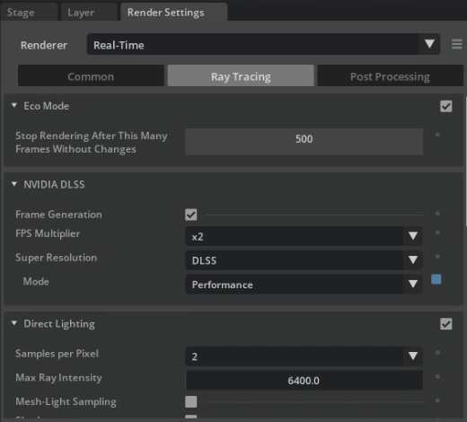

# IsaacSim Guide:

## Render Settings for more FPS:


## Debug:
1. **Could not process writer attach request…OmniGraphError: Tried to create a node in a path without a graph:**
Error: 
```bash
2024-10-12 22:47:25 [294,501ms] [Error] [omni.isaac.core_nodes.impl.base_writer_node] Could not process writer attach request (<omni.replicator.core.scripts.writers.NodeWriter object at 0x7fe7bc73e140>, '/Render/RenderProduct_Replicator_02'), OmniGraphError: Tried to create a node in a path without a graph - '/Render/PostProcess/SDGPipeline/RenderProduct_Replicator_02_NodeWriterWriter'
```
Solution:

[Solution It appears as though an extra “Render” layer can get saved in the layer stack when you run the simulation and then save the changes to the USD after running it. To fix this issue, delete the “Render” layer in the Layer stack and it should work the next time you run the simulation.](https://forums.developer.nvidia.com/t/could-not-process-writer-attach-request-omnigrapherror-tried-to-create-a-node-in-a-path-without-a-graph/309605
)

## Changing FastDDS to CycloneDDS:
1. Disable ROS2 Bridge (configured at Runtime with FastDDS)
    ```bash
    expoert ISAAC_ROS_BRIDGE_DISABLE=1
    ```
2. Export CycloneDDS Environment
    ```bash
    export RMW_IMPLEMENTATION=rmw_cyclonedds_cpp
    ```
[Link:](https://docs.isaacsim.omniverse.nvidia.com/latest/installation/install_ros.html)

## FastDDS IsaacSim Config:
XML Config used in [IsaacSim ROS Workspace Tutorials](https://github.com/isaac-sim/IsaacSim-ros_workspaces/blob/main/humble_ws/fastdds.xml)
```xml
<?xml version="1.0" encoding="UTF-8" ?>

<license>
SPDX-FileCopyrightText: Copyright (c) 2025 NVIDIA CORPORATION &amp; AFFILIATES. All rights reserved.
SPDX-License-Identifier: Apache-2.0

Licensed under the Apache License, Version 2.0 (the "License");
you may not use this file except in compliance with the License.
You may obtain a copy of the License at

http://www.apache.org/licenses/LICENSE-2.0

Unless required by applicable law or agreed to in writing, software
distributed under the License is distributed on an "AS IS" BASIS,
WITHOUT WARRANTIES OR CONDITIONS OF ANY KIND, either express or implied.
See the License for the specific language governing permissions and
limitations under the License.
</license>

<profiles xmlns="http://www.eprosima.com/XMLSchemas/fastRTPS_Profiles" >
    <transport_descriptors>
        <transport_descriptor>
            <transport_id>UdpTransport</transport_id>
            <type>UDPv4</type>
        </transport_descriptor>
    </transport_descriptors>

    <participant profile_name="udp_transport_profile" is_default_profile="true">
        <rtps>
            <userTransports>
                <transport_id>UdpTransport</transport_id>
            </userTransports>
            <useBuiltinTransports>false</useBuiltinTransports>
        </rtps>
    </participant>
</profiles>
```